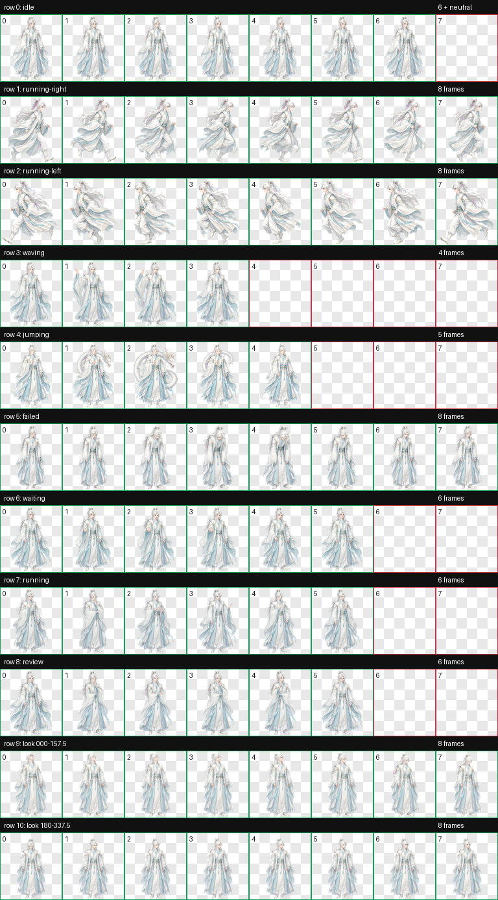
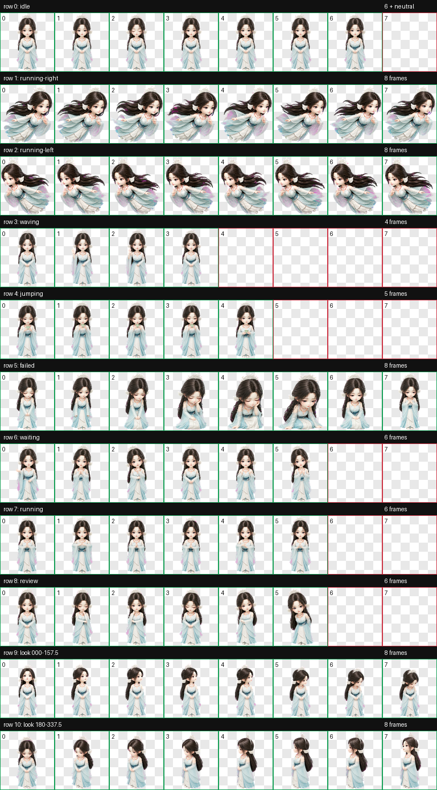

# Codex Pets

集中管理个人 Codex Desktop 动态 pets 的仓库。每只 pet 都是一个可独立安装、维护和追溯的目录，发布文件与生成/QA 工程放在一起管理。

## Pets

| Pet | 简介 | 格式 | 预览与说明 |
| --- | --- | --- | --- |
| 云珩（`yunheng`） | 白发月白仙袍、清冷俊雅的中国古风年轻仙君 | Codex Pet Sprite v2 | [查看 pet](yunheng/README.md) |
| 银月（`yinyue`） | 银发狐耳、异色瞳与月白短裙的灵动人形少女，悬停时模仿狐狸前爪 | Codex Pet Sprite v2 | [查看 pet](yinyue/README.md) |
| 宋玉（`songyu`） | 青白仙裙、白玉发冠的温柔人形少女，悬停吹茶、拖动时结印御空飞行 | Codex Pet Sprite v2 | [查看 pet](songyu/README.md) |






## 仓库结构

```text
codex-pets/
|-- AGENTS.md          # Codex 在本仓库中的开发与维护规则
|-- README.md          # 项目说明和 pet 索引
|-- LICENSE            # MIT License
`-- <pet-id>/
    |-- README.md      # 单只 pet 的介绍、预览和安装说明
    |-- pet.json       # Codex pet 元数据
    |-- spritesheet.webp
    |-- assets/        # 展示图与动画预览
    `-- source/        # 生成输入、中间文件与 QA 证据
```

后续 pet 直接添加为新的顶层目录，例如 `my-pet/`。目录名必须与 `pet.json` 的 `id` 一致，使用小写 ASCII kebab-case。

## 安装 pet

以 `yunheng` 为例，在仓库根目录运行 PowerShell：

```powershell
$petId = "yunheng"
$target = Join-Path $HOME ".codex\pets\$petId"
New-Item -ItemType Directory -Path $target -Force | Out-Null
Copy-Item ".\$petId\pet.json", ".\$petId\spritesheet.webp" -Destination $target -Force
```

复制完成后重启 Codex Desktop，然后在 pet 选择界面中选择对应角色。

安装目录中只需要：

```text
~/.codex/pets/<pet-id>/
|-- pet.json
`-- spritesheet.webp
```

## 新增或维护 pet

本仓库的新 pet 统一采用 Codex Pet Sprite v2：

- 8 列 x 11 行，单元格 `192 x 208`，完整图集 `1536 x 2288`。
- 前 9 行覆盖 Codex 标准状态动画，最后 2 行覆盖 16 个观察方向。
- `pet.json` 必须包含 `spriteVersionNumber: 2`。
- 发布前必须完成图集结构、透明背景、动作、方向语义、连续性和最终视觉 QA。

在 Codex 中创建或修改 pet 时，应使用项目的 [AGENTS.md](AGENTS.md) 约定和 `hatch-pet` 工作流。完成一只 pet 后：

1. 将 `pet.json` 与 `spritesheet.webp` 放到该 pet 的根目录。
2. 将精选预览放进 `assets/`，将可追溯工程放进 `source/`。
3. 编写该 pet 的 README，并更新本页的 Pets 表格。
4. 验证元数据、文件路径和 v2 图集，确认 QA 无阻塞项。

## 许可协议

本项目使用 [MIT License](LICENSE)。提交第三方参考图、字体、商标或其他素材前，请另行确认其授权允许纳入本仓库。
