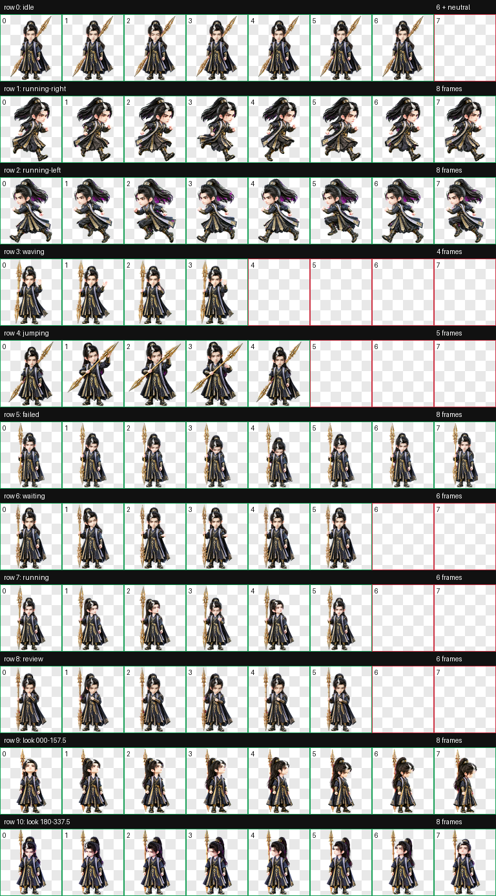
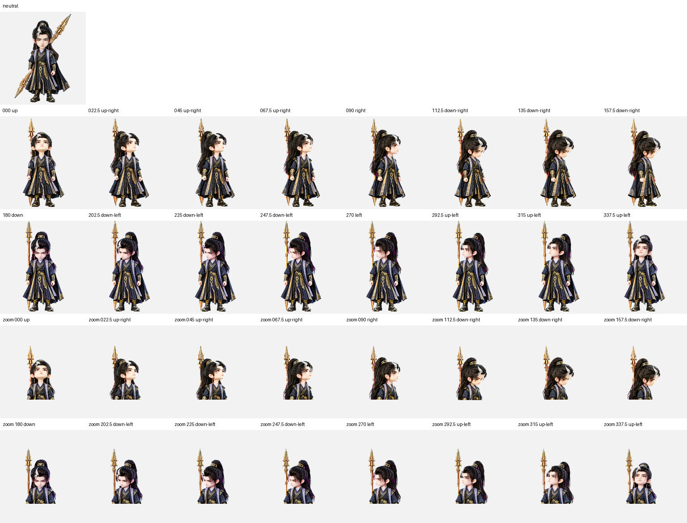

# 韩立·结丹巅峰

《凡人修仙传》动漫结丹巅峰时期韩立的 Codex Desktop Q 版动态桌宠。

形象采用精致中国 3D 动漫 Q 版造型，保留高束长发、银白前发、深蓝黑金纹法袍与双尖噬金虫金枪。`jumping` 状态不做跳跃，按已确认动作设计为双脚落地的摸枪流程：横枪、从枪头背面轻触检查，再回到初始姿势。

当前发布版为 2026-10-08 脸部重做版，九个标准动作与 16 个观察方向均使用新版形象，安装图集与本页动画预览同步更新。


## 动作总览



| 状态 | 效果 |
| --- | --- |
| `idle` | 沉静站立，双尖金枪斜背身后，呼吸与眨眼微动 |
| `running-right` | 无枪向右跑动，双臂自然交替摆动 |
| `running-left` | 无枪向左跑动，保持发型与衣饰侧别 |
| `waving` | 持枪抬手示意 |
| `jumping` | 双脚落地：横枪、从枪头背面轻触检查，再回到初始姿势 |
| `failed` | 克制地低头失落，再恢复站姿 |
| `waiting` | 竖枪等待确认，手臂与枪身无穿模 |
| `running` | 专注处理任务 |
| `review` | 凝神审阅结果 |
| Look directions | 16 个顺时针观察方向，金枪竖直背于身后 |


## 观察方向



方向按屏幕坐标顺时针排列：`000` 向上、`090` 向右、`180` 向下、`270` 向左；其余为相邻方向之间的观察姿势。

## 安装

在仓库根目录执行 PowerShell：

```powershell
$target = Join-Path $HOME ".codex\pets\hanli-jiedan-peak"
New-Item -ItemType Directory -Path $target -Force | Out-Null
Copy-Item .\hanli-jiedan-peak\pet.json, .\hanli-jiedan-peak\spritesheet.webp -Destination $target -Force
```

复制后重启 Codex Desktop，并在 pet 选择界面选择“韩立·结丹巅峰”。

## 图集规格与验证

| 项目 | 数值 |
| --- | --- |
| Sprite 版本 | 2 |
| 图集尺寸 | 1536 × 2288 |
| 网格 | 8 列 × 11 行 |
| 单帧尺寸 | 192 × 208 |
| 格式 | RGBA WebP |

正式安装图集已通过 `validate_atlas.py --require-v2` 校验，结构、透明背景与未使用单元格均无错误或警告。九个标准动作、16 向语义检查、三份隔离方向盲测和独立最终视觉 QA 均通过；盲测多数结果确认了全部 28 个方向轴判断。此次重做也修正了 `202.5°` 的朝向，现为屏幕左下。

连续性检测的 `157.5° → 180°` 和 `270° → 292.5°` 指标警告经视觉复核接受：前者是侧脸转正面低头的轮廓变化，后者是抬头变化，未见明显尺度跳变、基线跳动或方向反转。`337.5°` 接近向上，左向线索较轻，作为中间方向的轻微警告保留。详细结果与发布文件 SHA-256 见 [QA 记录](assets/release-qa.json)。

`pet.json` 与 `spritesheet.webp` 是安装文件；本地 `source/hanli-jiedan-peak-20261008-face-refactor` 保存此次重做的生成输入、中间产物与完整 QA 证据。生产源文件按仓库规则保留在本地，不随发布文件推送。
