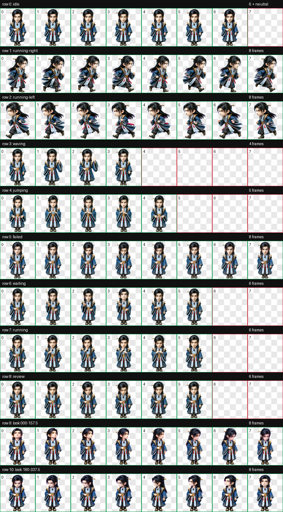

# 韩立·元婴

《凡人修仙传》动漫元婴期韩立的 Codex Desktop Q 版动态桌宠。

形象采用精致中国 3D 动漫 Q 版造型，保留半束黑色长发、金色发簪、深蓝金纹法袍、浅蓝灰交领、金色肩腰饰和红色垂带。`jumping` 状态按已确认动作设计为双脚落地、胸前掐诀结印。


## 动作总览



| 状态 | 效果 |
| --- | --- |
| `idle` | 沉静站立，轻微呼吸与眨眼 |
| `running-right` | 向右跑动，衣摆和长发自然跟随 |
| `running-left` | 向左跑动，保持服饰与发簪侧别 |
| `waving` | 克制抬手示意 |
| `jumping` | 双脚落地，在胸前掐诀结印 |
| `failed` | 低头失落后恢复站姿 |
| `waiting` | 安静等待确认或用户输入 |
| `running` | 专注处理任务 |
| `review` | 凝神审阅结果 |
| Look directions | 16 个顺时针观察方向 |

## 安装

在仓库根目录执行 PowerShell：

```powershell
$target = Join-Path $HOME ".codex\pets\hanli-yuanying"
New-Item -ItemType Directory -Path $target -Force | Out-Null
Copy-Item .\hanli-yuanying\pet.json, .\hanli-yuanying\spritesheet.webp -Destination $target -Force
```

复制后重启 Codex Desktop，并在 pet 选择界面选择“韩立·元婴”。

## 图集规格与验证

| 项目 | 数值 |
| --- | --- |
| Sprite 版本 | 2 |
| 图集尺寸 | 1536 × 2288 |
| 网格 | 8 列 × 11 行 |
| 单帧尺寸 | 192 × 208 |
| 格式 | RGBA WebP |

最终图集已通过 v2 结构与透明背景校验、16 向语义检查、三份隔离方向盲测、连续性检查和独立最终视觉 QA。重生成的 row 9/10 保持相同身份、尺度与脚底基线，四个 cardinal 方向均明确。

`pet.json` 与 `spritesheet.webp` 是安装文件；`source/hanli-yuanying-20260928` 保存生成输入、中间产物与完整 QA 证据。
