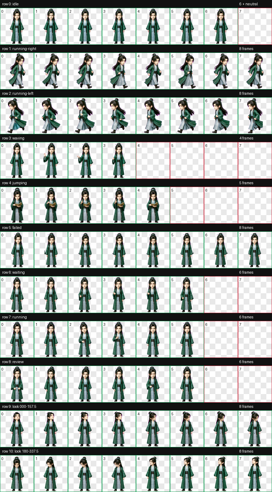

# 韩立（Han Li）

《凡人修仙传》动漫青竹小轩时期韩立的 Codex Desktop Q 版动态桌宠。

形象采用精致中国 3D 动漫 Q 版造型，保留深色束发、青色发簪、青绿竹纹外袍、浅青内衫与沉静锐利的眼神。`jumping` 状态按角色行为重新设计为双脚落地的古卷推演：阅读、翻页、双指推演阵法、颔首，再回到阅读。


## 动作总览



| 状态 | 效果 |
| --- | --- |
| `idle` | 沉静站立、呼吸与眨眼微动 |
| `running-right` | 向右拖动移动 |
| `running-left` | 向左拖动移动，保持发簪与衣饰侧别 |
| `waving` | 克制地抬手示意 |
| `jumping` | 青竹小轩古卷推演：阅读、翻页、双指推演、颔首，全程双脚落地 |
| `failed` | 收敛的失利反应 |
| `waiting` | 等待确认或用户输入 |
| `running` | 专注处理任务 |
| `review` | 凝神审阅结果 |
| Look directions | 16 个顺时针观察方向 |


## 安装

在仓库根目录执行 PowerShell：

```powershell
$target = Join-Path $HOME ".codex\pets\hanli"
New-Item -ItemType Directory -Path $target -Force | Out-Null
Copy-Item .\hanli\pet.json, .\hanli\spritesheet.webp -Destination $target -Force
```

复制后重启 Codex Desktop，并在 pet 选择界面选择“韩立”。

## 图集规格与验证

| 项目 | 数值 |
| --- | --- |
| Sprite 版本 | 2 |
| 图集尺寸 | 1536 × 2288 |
| 网格 | 8 列 × 11 行 |
| 单帧尺寸 | 192 × 208 |
| 格式 | RGBA WebP |

最终图集已通过 v2 结构与透明背景校验、9 行动作检查、16 向语义检查、三份隔离盲测、连续性检查和独立最终视觉 QA。连续性检测的少量数值警告已在正常桌宠尺寸下复核，无可见跳帧、逆转或身份变化。

`pet.json` 与 `spritesheet.webp` 是安装文件；`source/hanli-20260811-production` 保存生成输入、中间产物和完整 QA 证据。
