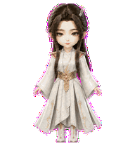
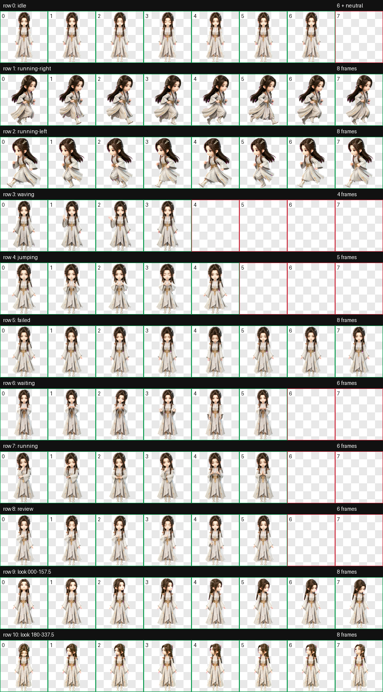
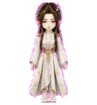
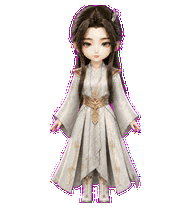

# 凌玉灵（Lingyuling）

一款适用于 Codex Desktop 的《凡人修仙传》动漫凌玉灵人形动态宠物。

造型采用系列统一的精致中国 3D 动漫 Q 版风格，保留凌玉灵的深色半束长发、右侧弧形梳饰、清雅眉眼以及灰白金星宫长袍。`jumping` 状态按用户确认方案定制为正面“双手比心—眨眼微笑—自然放下”：双脚始终落地，不跳跃、不悬浮，也不添加独立爱心或粒子特效。



## 特点

- 《凡人修仙传》动漫凌玉灵 Q 版人形造型
- 灰白金长袍、古金腰封与右侧弧形梳饰
- `jumping` 自定义为五帧正面双手比心循环
- 9 套 Codex 标准状态动画
- 16 个顺时针观察方向
- Codex Pet Sprite v2 格式
- 透明背景 WebP 图集

## 动作总览



| 状态 | 效果 |
| --- | --- |
| `idle` | 呼吸、垂眼与眨眼微动 |
| `running-right` | 向右移动的轻快步态 |
| `running-left` | 保留发饰侧别的独立左向步态 |
| `waving` | 正面温柔挥手问候 |
| `jumping` | 双手抬至胸前比心、闭眼微笑，再自然放下 |
| `failed` | 低头失落后恢复平静 |
| `waiting` | 展掌等待确认或用户输入 |
| `running` | 双脚落地、专注处理任务 |
| `review` | 垂眼凝神审阅任务结果 |
| Look directions | 16 个鼠标观察方向 |






## 安装

在仓库根目录执行 PowerShell：

```powershell
$target = Join-Path $HOME ".codex\pets\lingyuling"
New-Item -ItemType Directory -Path $target -Force | Out-Null
Copy-Item .\lingyuling\pet.json, .\lingyuling\spritesheet.webp -Destination $target -Force
```

复制完成后重启 Codex Desktop，然后在 pet 选择界面中选择“凌玉灵”。

## 文件结构

```text
lingyuling/
|-- README.md
|-- pet.json
|-- spritesheet.webp
|-- assets/
|   |-- contact-sheet.png
|   |-- idle.gif
|   |-- jumping.gif
|   |-- running-left.gif
|   |-- running-right.gif
|   `-- waving.gif
`-- source/
    `-- lingyuling-20260813-base-candidate/   # 生成输入、中间产物与完整 QA 证据
```

## 图集规格与验证

| 项目 | 数值 |
| --- | --- |
| Sprite 版本 | 2 |
| 图集尺寸 | 1536 × 2288 |
| 网格 | 8 列 × 11 行 |
| 单帧尺寸 | 192 × 208 |
| 格式 | RGBA WebP |

最终图集已通过 Codex v2 图集验证、逐行动作检查、16 方向语义检查、三份隔离盲测、连续性复核与独立最终视觉 QA。跨方向行边界的像素差警告经正常显示尺寸复核，未发现显著尺度弹跳、方向反转或轮廓破损。

## 说明

`pet.json` 和 `spritesheet.webp` 是 Codex Desktop 安装所需的发布文件；`source/lingyuling-20260813-base-candidate` 保存可追溯的生成输入、中间产物和 QA 证据，不参与日常安装。
