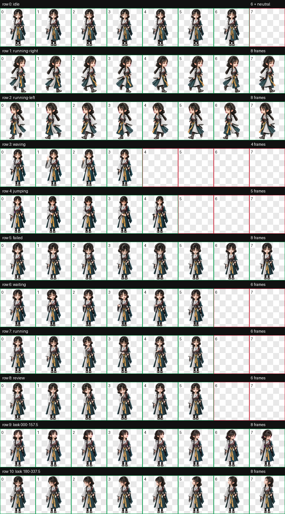

# 李缨宁（Liyingning）

一款适用于 Codex Desktop 的《凡人修仙传》动漫李缨宁 Q 版人形动态宠物。

造型采用统一的精致中国 3D 动漫 Q 版风格，保留双辫发型、灰白宽袖、青绿色护甲长袍、佩剑与腰间暖阳宝玉。默认待机为正面持剑姿态；鼠标悬停动作不跳跃，而是低头、用空手轻触暖阳宝玉，再自然回到站姿。


## 特点

- 《凡人修仙传》动漫李缨宁人形造型
- 灰白与青绿色侠装、双辫、佩剑和暖阳宝玉
- 默认正面持剑待机
- `jumping` 自定义为五帧低头触摸暖阳宝玉循环，双脚始终落地
- 9 套 Codex 标准状态动画
- 16 个顺时针观察方向
- Codex Pet Sprite v2 格式
- 透明背景 WebP 图集

## 动作总览



| 状态 | 效果 |
| --- | --- |
| `idle` | 正面持剑呼吸待机 |
| `running-right` | 向右移动，衣袖与裙摆自然跟随 |
| `running-left` | 向左移动，保持与右移动一致的视觉尺度 |
| `waving` | 挥手问候 |
| `jumping` | 鼠标悬停：低头注视宝玉、空手轻触宝玉、回到站姿，全程不跳跃 |
| `failed` | 低头失落的失败反馈 |
| `waiting` | 等待确认或用户输入 |
| `running` | 专注处理任务 |
| `review` | 审阅任务结果 |
| Look directions | 16 个顺时针观察方向 |


## 安装

在仓库根目录执行 PowerShell：

```powershell
$target = Join-Path $HOME ".codex\pets\liyingning"
New-Item -ItemType Directory -Path $target -Force | Out-Null
Copy-Item .\liyingning\pet.json, .\liyingning\spritesheet.webp -Destination $target -Force
```

复制完成后重启 Codex Desktop，然后在 pet 选择界面中选择“李缨宁”。

## 文件结构

```text
liyingning/
|-- README.md
|-- pet.json
|-- spritesheet.webp
|-- assets/
|   |-- contact-sheet.png
|   |-- idle.gif
|   |-- jumping.gif
|   |-- running-left.gif
|   |-- running-right.gif
|   `-- waving.gif
`-- source/
    |-- liyingning-20260925-concepts/   # 候选形象与动作选型
    `-- liyingning-20260925-production/ # 生产输入、中间产物与完整 QA 证据
```

## 图集规格与验证

| 项目 | 数值 |
| --- | --- |
| Sprite 版本 | 2 |
| 图集尺寸 | 1536 × 2288 |
| 网格 | 8 列 × 11 行 |
| 单帧尺寸 | 192 × 208 |
| 格式 | RGBA WebP |

最终图集已通过 Codex v2 图集验证、逐行动作检查、方向语义检查、三份隔离盲测、连续性检查与最终视觉 QA。方向环最后三格已复核为连续的左上抬头动作；极低头的 157.5° 与 202.5° 水平分量较弱，但不影响完整方向语义与循环连续性。

## 说明

`pet.json` 和 `spritesheet.webp` 是 Codex Desktop 安装所需的发布文件；`source/` 保存可追溯的概念选型、生成输入、中间产物和 QA 证据，不参与日常安装。
