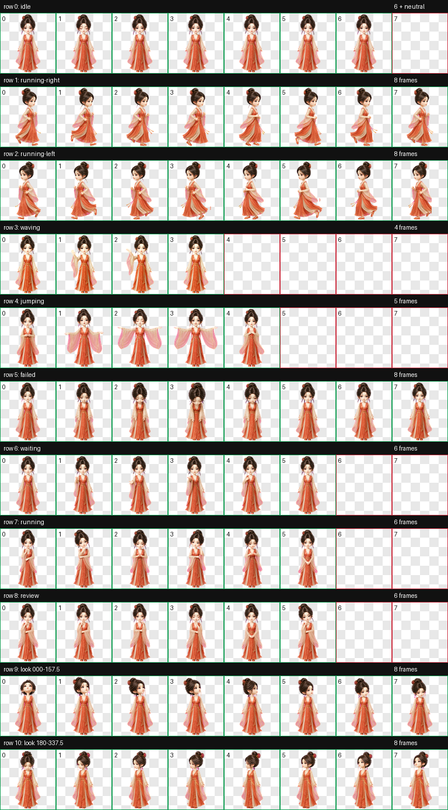
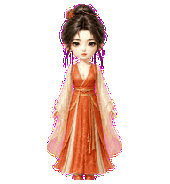

# 慕沛灵（Mupeiling）

一款适用于 Codex Desktop 的《凡人修仙传》动漫慕沛灵人形动态宠物。

造型采用与银月、宋玉一致的精致中国 3D 动漫 Q 版风格，保留慕沛灵的深色发髻、温柔眉眼、垂坠耳饰与橙红色古装。`jumping` 状态按角色向往自由的人设定制为正面“迎风展臂—缓缓收回”动作：双脚始终落地，不跳跃，也不回眸。


## 特点

- 《凡人修仙传》动漫慕沛灵 Q 版人形造型
- 橙红仙裙、深色发髻、垂坠耳饰与温柔眉眼
- `jumping` 自定义为五帧正面自由展臂循环
- 左右移动保持与待机状态一致的角色高度和落脚基线
- 9 套 Codex 标准状态动画
- 16 个顺时针观察方向
- Codex Pet Sprite v2 格式
- 透明背景 WebP 图集

## 动作总览



| 状态 | 效果 |
| --- | --- |
| `idle` | 呼吸、眨眼与衣袖轻微摆动 |
| `running-right` | 保持待机体型向右移动 |
| `running-left` | 与向右移动等比例、同基线的镜像动作 |
| `waving` | 温柔挥手问候 |
| `jumping` | 双手从身前舒展到两侧，面带自由微笑，再缓缓收回 |
| `failed` | 低头失落的失败反馈 |
| `waiting` | 等待确认或用户输入 |
| `running` | 专注处理任务 |
| `review` | 审阅任务结果 |
| Look directions | 16 个鼠标观察方向 |




## 安装

在仓库根目录执行 PowerShell：

```powershell
$target = Join-Path $HOME ".codex\pets\mupeiling"
New-Item -ItemType Directory -Path $target -Force | Out-Null
Copy-Item .\mupeiling\pet.json, .\mupeiling\spritesheet.webp -Destination $target -Force
```

复制完成后重启 Codex Desktop，然后在 pet 选择界面中选择“慕沛灵”。

## 文件结构

```text
mupeiling/
|-- README.md
|-- pet.json
|-- spritesheet.webp
|-- assets/
|   |-- contact-sheet.png
|   |-- idle.gif
|   |-- jumping.gif
|   |-- running-left.gif
|   |-- running-right.gif
|   `-- waving.gif
`-- source/
    `-- mupeiling-20260724/   # 生成输入、中间产物与完整 QA 证据
```

## 图集规格与验证

| 项目 | 数值 |
| --- | --- |
| Sprite 版本 | 2 |
| 图集尺寸 | 1536 × 2288 |
| 网格 | 8 列 × 11 行 |
| 单帧尺寸 | 192 × 208 |
| 格式 | RGBA WebP |

最终图集已通过 Codex v2 图集验证、逐行动作检查、16 方向语义检查、三份隔离盲测、连续性检查与独立最终视觉 QA。左右移动帧的角色高度均为 198 像素、落脚基线一致；视线方向与连续性检查均无阻塞项。

## 说明

`pet.json` 和 `spritesheet.webp` 是 Codex Desktop 安装所需的发布文件；`source/mupeiling-20260724` 保存可追溯的生成输入、中间产物和 QA 证据，不参与日常安装。
