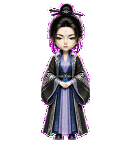
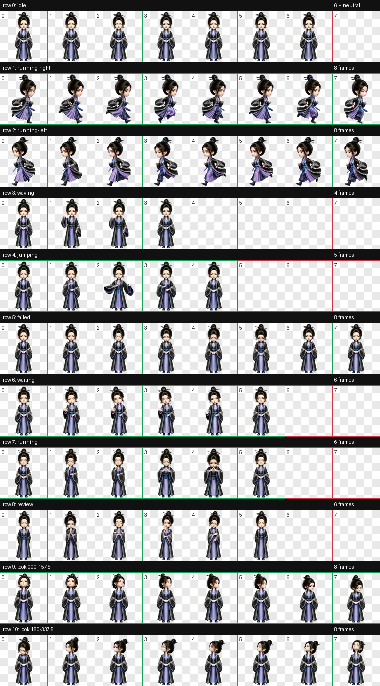
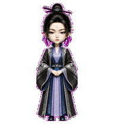
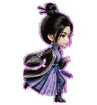
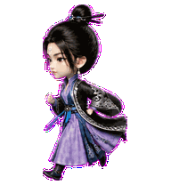
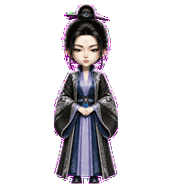

# 南宫阙（Nangong Que）

一款适用于 Codex Desktop 的《凡人修仙传》动漫南宫阙 Q 版人形动态桌宠。

造型采用系列统一的精致中国 3D 动漫 Q 版风格，以用户确认的 B1 晋升稿为身份基准，保留黑色高髻与发簪、额心银白纹饰、冷静锐利的眉眼、垂坠耳饰，以及深蓝、靛紫与银纹相间的古装。`jumping` 状态没有采用跳跃，而是定制为正面贴地的“静立拂袖结印”动作：双脚与裙摆基线稳定，拂袖起势、凝神结印，再从容收势。



## 特点

- 南宫阙 B1 晋升版 Q 版人形造型，重点校准眼型、瞳色与目光气质
- 黑色高髻、发簪、额心银白纹饰、垂坠耳饰与蓝紫银纹长袍
- `jumping` 自定义为五帧正面贴地拂袖结印循环，不发生跳跃或纵向位移
- 左右移动保持与待机状态一致的角色尺度和落脚基线
- 9 套 Codex 标准状态动画
- 16 个顺时针观察方向
- Codex Pet Sprite v2 格式
- 透明背景 WebP 图集

## 动作总览



| 状态 | 效果 |
| --- | --- |
| `idle` | 呼吸、眨眼与衣袖轻微摆动 |
| `running-right` | 保持角色尺度向右移动 |
| `running-left` | 独立生成的向左移动动作，避免饰品与衣纹产生镜像错误 |
| `waving` | 克制而端庄的正面挥手问候 |
| `jumping` | 双脚落地，拂袖起势、凝神结印并从容收势 |
| `failed` | 神情收敛、低头反思的失败反馈 |
| `waiting` | 镇定站立，等待确认或用户输入 |
| `running` | 凝神调息、专注处理任务 |
| `review` | 审阅任务结果 |
| Look directions | 16 个鼠标观察方向 |









## 安装

在仓库根目录执行 PowerShell：

```powershell
$target = Join-Path $HOME ".codex\pets\nangong-que"
New-Item -ItemType Directory -Path $target -Force | Out-Null
Copy-Item .\nangong-que\pet.json, .\nangong-que\spritesheet.webp -Destination $target -Force
```

复制完成后重启 Codex Desktop，然后在 pet 选择界面中选择“南宫阙”。

## 文件结构

```text
nangong-que/
|-- README.md
|-- pet.json
|-- spritesheet.webp
|-- assets/
|   |-- contact-sheet.png
|   |-- idle.gif
|   |-- jumping.gif
|   |-- running-left.gif
|   |-- running-right.gif
|   `-- waving.gif
`-- source/
    `-- nangong-que-20260814/   # 标准 pet 生成输入、中间产物与完整 QA 证据
```

## 图集规格与验证

| 项目 | 数值 |
| --- | --- |
| Sprite 版本 | 2 |
| 图集尺寸 | 1536 × 2288 |
| 网格 | 8 列 × 11 行 |
| 单帧尺寸 | 192 × 208 |
| 格式 | RGBA WebP |

最终图集通过 Codex v2 图集验证、逐行动作检查、16 方向语义检查、三份隔离盲测、连续性复核与独立最终视觉 QA。方向序列中少数靠近主方向的过渡角度采用克制幅度，经复核不存在象限反转、边缘裁切或身份漂移。

## 说明

`pet.json` 和 `spritesheet.webp` 是 Codex Desktop 安装所需的发布文件；`source/` 保存可追溯的生成输入、中间产物和 QA 证据，不参与日常安装。
