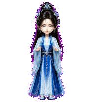
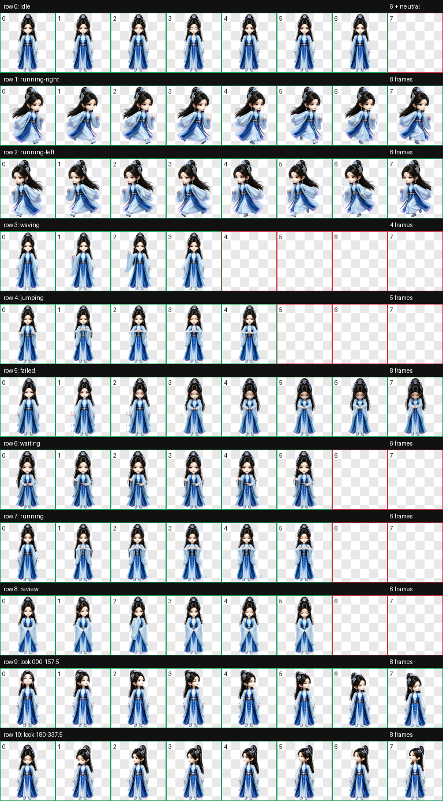
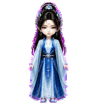
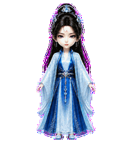

# 南宫婉（Nangong Wan）

一款适用于 Codex Desktop 的《凡人修仙传》动漫南宫婉 Q 版人形动态桌宠。

造型采用系列统一的精致中国 3D 动漫 Q 版风格，保留黑色高髻、银蓝发冠、额心红纹、垂珠耳饰以及冰蓝与深蓝相间的绣纹仙裙。`jumping` 状态定制为正面站立“双手掐诀”：双脚始终落地，以抬手结印、凝神闭眼和轻微复位代替字面跳跃。



## 特点

- 《凡人修仙传》动漫南宫婉 Q 版人形造型
- 黑色高髻、银蓝发冠、额心红纹与蓝白仙裙
- `jumping` 自定义为五帧双手掐诀循环，全程不跳跃
- 左右移动保持与待机状态一致的视觉尺度和落脚基线
- 9 套 Codex 标准状态动画
- 16 个顺时针观察方向
- Codex Pet Sprite v2 格式
- 透明背景 WebP 图集

## 动作总览



| 状态 | 效果 |
| --- | --- |
| `idle` | 正面定姿，以轻微呼吸、眨眼和细小衣摆变化维持生命感 |
| `running-right` | 保持角色尺度向画面右侧移动 |
| `running-left` | 保持角色尺度向画面左侧移动 |
| `waving` | 单手抬起，克制地挥手问候 |
| `jumping` | 双手抬至胸前结印，短暂闭眼凝神后轻微复位，双脚始终落地 |
| `failed` | 低头垂眸，肩颈与手臂呈现克制的失落 |
| `waiting` | 双手在身前合拢，安静等待用户输入 |
| `running` | 双手结印，专注处理任务但不发生位移 |
| `review` | 敛袖抬手、转动视线复核结果 |
| Look directions | 16 个顺时针观察方向 |






## 安装

在仓库根目录执行 PowerShell：

```powershell
$target = Join-Path $HOME ".codex\pets\nangong-wan"
New-Item -ItemType Directory -Path $target -Force | Out-Null
Copy-Item .\nangong-wan\pet.json, .\nangong-wan\spritesheet.webp -Destination $target -Force
```

复制完成后重启 Codex Desktop，然后在 pet 选择界面中选择“南宫婉”。

## 文件结构

```text
nangong-wan/
|-- README.md
|-- pet.json
|-- spritesheet.webp
|-- assets/
|   |-- contact-sheet.png
|   |-- idle.gif
|   |-- jumping.gif
|   |-- running-left.gif
|   |-- running-right.gif
|   `-- waving.gif
`-- source/
    |-- nangong-wan-20260810/              # 已确认 canonical-base 与概念来源
    `-- nangong-wan-20260810-production/   # 动画生成、中间产物与 QA 证据
```

## 图集规格与验证

| 项目 | 数值 |
| --- | --- |
| Sprite 版本 | 2 |
| 图集尺寸 | 1536 × 2288 |
| 网格 | 8 列 × 11 行 |
| 单帧尺寸 | 192 × 208 |
| 格式 | RGBA WebP |

最终图集已通过 Codex v2 图集结构、透明背景、色键残留、逐行动作、16 方向语义和连续性检查。方向循环在 `157.5° → 180°` 与 `337.5° → 0°` 的批次衔接处变化幅度较大，已保留为非阻塞连续性警告；实际方向顺序与屏幕左右语义正确。

## 说明

`pet.json` 和 `spritesheet.webp` 是 Codex Desktop 安装所需的发布文件；`source/` 保存可追溯的生成输入、中间产物和 QA 证据，不参与日常安装。
