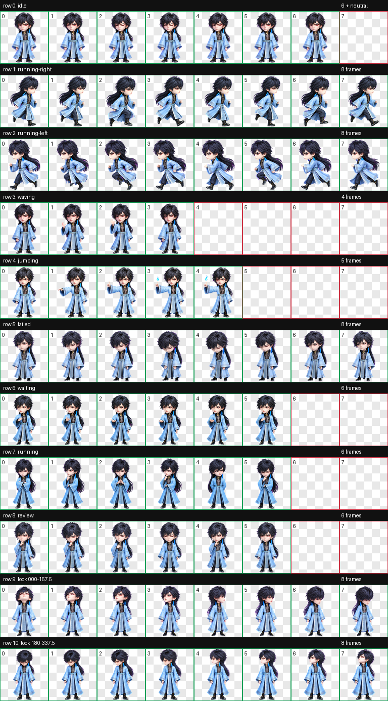
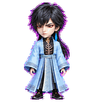

# 玄骨（Xuangu）

一款适用于 Codex Desktop 的《凡人修仙传》动漫玄骨动态宠物。

玄骨采用统一系列的精致中国 3D 动漫 Q 版造型：黑色长发、狭长冷峻眼型、红色下眼妆、左耳蓝羽耳饰、冰蓝宽袖长袍、黑色骨纹胸甲与金色领饰构成固定辨识点。鼠标悬停时，他会站定伸出右手，在指尖点燃一簇蓝色灵焰。


## 特点

- 《凡人修仙传》动漫玄骨造型
- 约三头身的精致中国 3D 动漫 Q 版男性角色
- 黑色长发、红色下眼妆、蓝羽耳饰与冰蓝黑金服装
- 悬停时右手指尖点燃蓝色灵焰，双脚保持落地
- 9 套 Codex 标准状态动画
- 16 个顺时针观察方向
- Codex Pet Sprite v2 格式
- 透明背景 WebP 图集

## 动作总览



| 状态 | 效果 |
| --- | --- |
| `idle` | 冷峻站姿、呼吸与眨眼 |
| `running-right` | 向右拖动移动 |
| `running-left` | 向左拖动移动，单独生成以保留蓝羽耳饰侧别 |
| `waving` | 克制抬手问候 |
| `jumping` | 鼠标悬停：站定伸出右手，指尖点燃蓝色灵焰 |
| `failed` | 低头闭眼的失落反馈 |
| `waiting` | 抬手等待用户确认或输入 |
| `running` | 站定专注处理任务 |
| `review` | 以眼神与轻微转头审阅结果 |
| Look directions | 16 个鼠标观察方向 |




## 安装

在仓库根目录执行 PowerShell：

```powershell
$target = Join-Path $HOME ".codex\pets\xuangu"
New-Item -ItemType Directory -Path $target -Force | Out-Null
Copy-Item .\xuangu\pet.json, .\xuangu\spritesheet.webp -Destination $target -Force
```

复制完成后重启 Codex Desktop，然后在 pet 选择界面中选择“玄骨”。

## 文件结构

```text
xuangu/
|-- README.md
|-- pet.json
|-- spritesheet.webp
|-- assets/
|   |-- contact-sheet.png
|   |-- idle.gif
|   |-- jumping.gif
|   `-- waving.gif
`-- source/
    `-- xuangu-20260929/   # 最终生成输入与精简 QA 证据
```

## 图集规格与验证

| 项目 | 数值 |
| --- | --- |
| Sprite 版本 | 2 |
| 图集尺寸 | 1536 × 2288 |
| 网格 | 8 列 × 11 行 |
| 单帧尺寸 | 192 × 208 |
| 格式 | RGBA WebP |

最终图集通过 Codex v2 图集验证、透明背景处理、逐行动作检查、方向语义检查、三份隔离盲测、连续性检查与最终视觉复核。部分中间方向的水平线索较轻，但在带标签的正常尺寸连续循环中保持正确象限与顺时针过渡；四个基准方向均通过盲测硬门槛。

## 说明

`pet.json` 和 `spritesheet.webp` 是安装所需的发布文件；`source/xuangu-20260929` 仅保留可追溯的最终生成输入、发布图集副本与必要 QA 证据，不参与日常安装。
