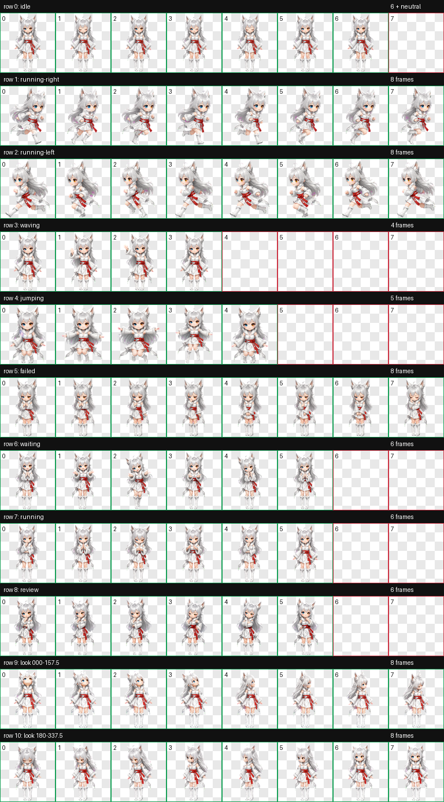

# 银月（Yinyue）

一款适用于 Codex Desktop 的《凡人修仙传》动漫银月人形动态宠物。

银月采用适合桌面小尺寸显示的 Q 版中国 3D 动漫造型：银白长发与狐耳、蓝/琥珀异色瞳、狐耳金属饰环、月白短裙、红色束腰和白色绒毛领共同构成固定辨识点。动作设计强调灵狐少女的俏皮、机敏和细腻表情。


## 特点

- 《凡人修仙传》动漫银月人形造型
- 三头身 Q 版人形灵狐少女
- 银发狐耳、异色瞳、金属耳饰与红色束腰
- 9 套 Codex 标准状态动画
- 16 个顺时针观察方向
- Codex Pet Sprite v2 格式
- 透明背景 WebP 图集

## 动作总览



| 状态 | 效果 |
| --- | --- |
| `idle` | 呼吸、眨眼与发丝微动 |
| `running-right` | 向右拖动移动 |
| `running-left` | 向左拖动移动，保留异色瞳与耳饰解剖侧别 |
| `waving` | 俏皮挥手问候 |
| `jumping` | 稳定比例的轻巧跳跃 |
| `failed` | 保留狐耳与耳饰的沮丧反馈 |
| `waiting` | 等待确认或用户输入 |
| `running` | 专注处理任务 |
| `review` | 审阅任务结果 |
| Look directions | 16 个鼠标观察方向 |


## 安装

在仓库根目录执行 PowerShell：

```powershell
$target = Join-Path $HOME ".codex\pets\yinyue"
New-Item -ItemType Directory -Path $target -Force | Out-Null
Copy-Item .\yinyue\pet.json, .\yinyue\spritesheet.webp -Destination $target -Force
```

复制完成后重启 Codex Desktop，然后在 pet 选择界面中选择“银月”。

## 文件结构

```text
yinyue/
|-- README.md
|-- pet.json
|-- spritesheet.webp
|-- assets/
|   |-- contact-sheet.png
|   |-- idle.gif
|   |-- jumping.gif
|   `-- waving.gif
`-- source/
    `-- yinyue-20260722/   # 生成输入、中间文件与完整 QA 证据
```

## 图集规格与验证

| 项目 | 数值 |
| --- | --- |
| Sprite 版本 | 2 |
| 图集尺寸 | 1536 × 2288 |
| 网格 | 8 列 × 11 行 |
| 单帧尺寸 | 192 × 208 |
| 格式 | RGBA WebP |

最终图集已通过 Codex v2 图集验证、逐行动作检查、方向语义检查、三份隔离盲测、连续性检查与最终视觉 QA。方向 `112.5°` 的垂直线索较轻，但在正常尺寸和有序循环中明确保持右下语义。

## 说明

`pet.json` 和 `spritesheet.webp` 是安装所需的发布文件；`source/yinyue-20260722` 保存可追溯的生成输入、中间产物和 QA 证据，不参与日常安装。
