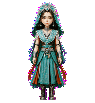
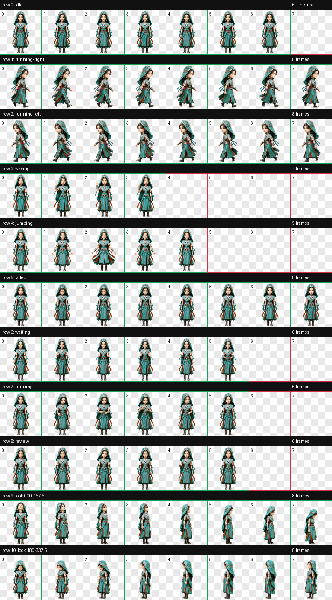
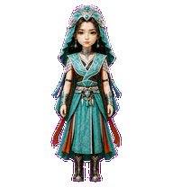
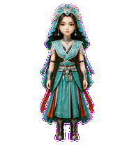

# 乐上师（yueshangshi）

一款适用于 Codex Desktop 的《凡人修仙传》动画乐上师 Q 版动态桌宠。

角色采用精致中国 3D 动漫 Q 版造型，保留黑色长发、青绿头纱、银色翠玉额饰、青绿银纹肩甲、深褐红内层、青绿裙装、腰间银饰和深色长靴。整体使用纤细、紧凑的全身轮廓，适合桌面小尺寸显示。



## 特点

- 《凡人修仙传》动画幕兰法士乐上师形象
- 纤细的三头身中国 3D 动漫 Q 版造型
- 青绿头纱、银色翠玉额饰与青绿银纹祭服
- 9 套 Codex 标准状态动画
- 16 个顺时针观察方向
- Codex Pet Sprite v2 格式
- 透明背景 WebP 图集

## 动作总览



| 状态 | 效果 |
| --- | --- |
| `idle` | 呼吸、眨眼与轻微衣饰起伏 |
| `running-right` | 面向屏幕右侧的拖动移动步态 |
| `running-left` | 面向屏幕左侧的镜像拖动移动步态 |
| `waving` | 克制的抬手问候 |
| `jumping` | 双脚保持落地，双手斜向展开，裙摆与飘带舒展 |
| `failed` | 保持角色气质的低头失落反应 |
| `waiting` | 摊手等待确认或用户输入 |
| `running` | 站立专注处理任务 |
| `review` | 通过眼神、低头与轻微手势审阅结果 |
| Look directions | 16 个顺时针观察方向 |





## 安装

在仓库根目录执行 PowerShell：

```powershell
$target = Join-Path $HOME ".codex\pets\yueshangshi"
New-Item -ItemType Directory -Path $target -Force | Out-Null
Copy-Item .\yueshangshi\pet.json, .\yueshangshi\spritesheet.webp -Destination $target -Force
```

复制完成后重启 Codex Desktop，然后在 pet 选择界面中选择“乐上师”。

## 文件结构

```text
yueshangshi/
|-- README.md
|-- pet.json
|-- spritesheet.webp
|-- assets/
|   |-- contact-sheet.png
|   |-- idle.gif
|   |-- jumping.gif
|   `-- waving.gif
`-- source/
    |-- yueshangshi-20260810-base-selection/
    `-- yueshangshi-20260810-production/
```

## 图集规格与验证

| 项目 | 数值 |
| --- | --- |
| Sprite 版本 | 2 |
| 图集尺寸 | 1536 × 2288 |
| 网格 | 8 列 × 11 行 |
| 单帧尺寸 | 192 × 208 |
| 格式 | RGBA WebP |

最终图集已通过 Codex v2 图集验证、逐行动作检查、三份隔离方向盲测、方向语义复核、连续性检查与最终视觉 QA。方向 `247.5°`、`292.5°` 和 `315°` 的垂直线索较轻，但在有标签的正常尺寸方向环中保持正确象限且没有反转。

## 说明

`pet.json` 和 `spritesheet.webp` 是安装所需的发布文件；`source/yueshangshi-20260810-production` 保存可追溯的生成输入、中间产物与 QA 证据，不参与日常安装。
