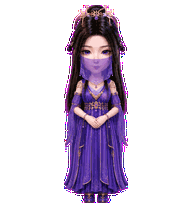
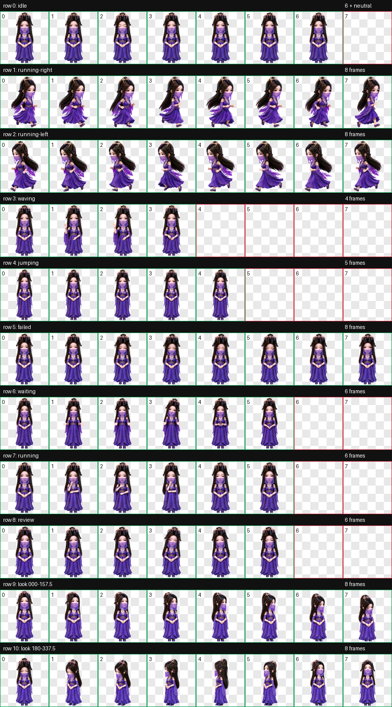
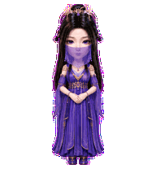
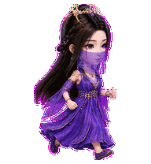
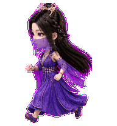
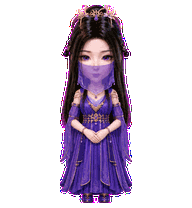

# 紫灵（Ziling）

一款适用于 Codex Desktop 的《凡人修仙传》动漫紫灵 Q 版人形动态桌宠。

造型采用系列统一的精致中国 3D 动漫 Q 版风格，保留紫灵的黑色长发、紫色眼眸、半透明紫色面纱、紫蓝仙裙、金色腰饰与发饰。`jumping` 状态按角色端庄含蓄的气质定制为正面“敛袖轻礼”：双脚始终落地，以轻微收袖和眼神回应代替字面跳跃或明显躬身。



## 特点

- 《凡人修仙传》动漫紫灵 Q 版人形造型
- 紫色眼眸、半透明面纱、紫蓝仙裙与金色饰件
- `jumping` 自定义为五帧正面敛袖轻礼循环
- 左右移动保持与待机状态一致的视觉尺度和落脚基线
- 9 套 Codex 标准状态动画
- 16 个顺时针观察方向
- Codex Pet Sprite v2 格式
- 透明背景 WebP 图集

## 动作总览



| 状态 | 效果 |
| --- | --- |
| `idle` | 轻微呼吸、眨眼与衣袖变化 |
| `running-right` | 保持角色尺度向画面右侧移动 |
| `running-left` | 保持角色尺度向画面左侧移动 |
| `waving` | 单手优雅挥手问候 |
| `jumping` | 双手保持相叠，小幅收拢衣袖并以眼神回应，再平滑复位 |
| `failed` | 低头、垂眸与轻微收肩的克制失落 |
| `waiting` | 双掌前伸，期待用户确认或输入 |
| `running` | 以近身手势和视线变化专注处理任务 |
| `review` | 轻微前倾、转头与眨眼复核结果 |
| Look directions | 16 个顺时针观察方向 |









## 安装

在仓库根目录执行 PowerShell：

```powershell
$target = Join-Path $HOME ".codex\pets\ziling"
New-Item -ItemType Directory -Path $target -Force | Out-Null
Copy-Item .\ziling\pet.json, .\ziling\spritesheet.webp -Destination $target -Force
```

复制完成后重启 Codex Desktop，然后在 pet 选择界面中选择“紫灵”。

## 文件结构

```text
ziling/
|-- README.md
|-- pet.json
|-- spritesheet.webp
|-- assets/
|   |-- contact-sheet.png
|   |-- idle.gif
|   |-- jumping.gif
|   |-- running-left.gif
|   |-- running-right.gif
|   `-- waving.gif
`-- source/
    `-- ziling-20260728/   # 生成输入、中间产物与完整 QA 证据
```

## 图集规格与验证

| 项目 | 数值 |
| --- | --- |
| Sprite 版本 | 2 |
| 图集尺寸 | 1536 × 2288 |
| 网格 | 8 列 × 11 行 |
| 单帧尺寸 | 192 × 208 |
| 格式 | RGBA WebP |

最终图集已通过 Codex v2 图集验证、逐行动作检查、16 方向语义检查、三份隔离盲测、连续性检查与独立最终视觉 QA。四个基准方向全部通过；`112.5°` 的向下提示较细微，已作为非阻塞警告记录，标注循环仍明确呈现向右下观察。

## 说明

`pet.json` 和 `spritesheet.webp` 是 Codex Desktop 安装所需的发布文件；`source/ziling-20260728` 保存可追溯的生成输入、中间产物和 QA 证据，不参与日常安装。
